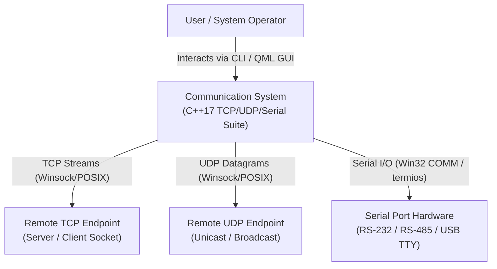
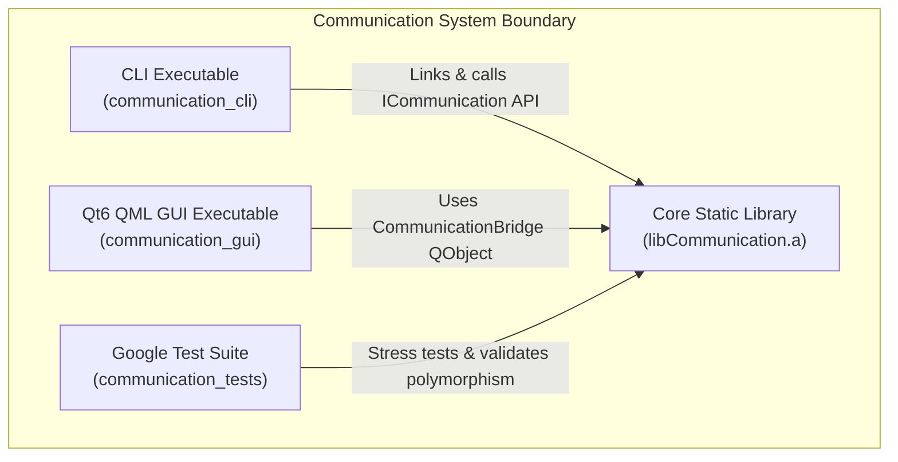
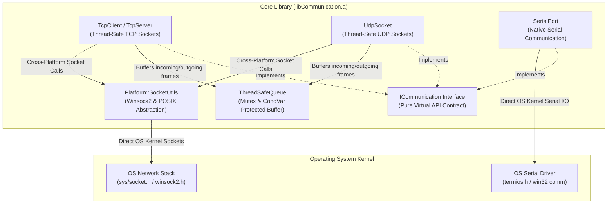
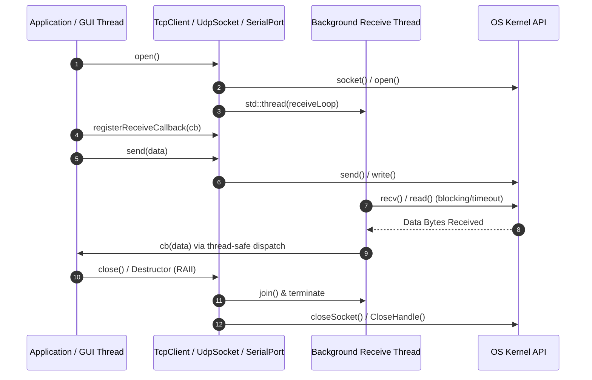

# C4 Architecture Model - Modern C++17 Communication Library

This document outlines the software architecture for the cross-platform **Communication Library** using the **C4 Model** (Context, Containers, Components, and Code). It includes both **ASCII** and **Mermaid** diagrams for each architectural level.

---

## 1. System Context Diagram (Level 1)

The System Context diagram illustrates how human actors and external hardware/network entities interact with the Communication System.

### ASCII Diagram

```
+-------------------+        +-------------------+        +---------------------+
|   System Operator |        |   CLI / GUI User  |        | Hardware Technician |
+-------------------+        +-------------------+        +---------------------+
          |                            |                             |
          +----------------------------+-----------------------------+
                                       |
                                       v
                     +-----------------------------------+
                     |   Communication System            |
                     |   (C++17 TCP/UDP/Serial Lib)      |
                     +-----------------------------------+
                                       |
       +-------------------------------+-------------------------------+
       |                               |                               |
       v                               v                               v
+------------------+          +------------------+          +------------------+
|  Remote TCP Peer |          |  Remote UDP Peer |          | Serial Port Device|
|  (Server/Client) |          | (Unicast/Bcast)  |          | (RS232/RS485 TTY)|
+------------------+          +------------------+          +------------------+
```

### Mermaid Diagram



---

## 2. Container Diagram (Level 2)

The Container diagram shows the high-level executables and static library targets produced by the CMake build system.

### ASCII Diagram

```
+-----------------------------------------------------------------------------------+
| Communication Repository Boundary                                                 |
|                                                                                   |
|  +---------------------------+                +---------------------------------+  |
|  | CLI Client                |                | Qt6 QML GUI Client              |  |
|  | (communication_cli)       |                | (communication_gui)             |  |
|  +---------------------------+                +---------------------------------+  |
|                |                                              |                   |
|                +-----------------------+----------------------+                   |
|                                        |                                          |
|                                        v                                          |
|                       +---------------------------------+                         |
|                       | Core Static Library             |                         |
|                       | (libCommunication.a)            |                         |
|                       +---------------------------------+                         |
|                                        ^                                          |
|                                        |                                          |
|                       +---------------------------------+                         |
|                       | Google Test Suite               |                         |
|                       | (communication_tests)           |                         |
|                       +---------------------------------+                         |
+-----------------------------------------------------------------------------------+
```

### Mermaid Diagram



---

## 3. Component Diagram (Level 3)

The Component diagram reveals the internal software components inside `libCommunication.a` and how they interface with the operating system kernel.

### ASCII Diagram

```
+---------------------------------------------------------------------------------------+
| Core Static Library (libCommunication.a)                                             |
|                                                                                       |
|      +-------------------------------------------------------------------------+      |
|      |                        ICommunication (Abstract API)                    |      |
|      +-------------------------------------------------------------------------+      |
|           ^                         ^                        ^                        |
|           |                         |                        |                        |
|  +------------------+      +------------------+     +------------------+              |
|  |    TcpClient     |      |    UdpSocket     |     |    SerialPort    |              |
|  |    TcpServer     |      |                  |     |                  |              |
|  +------------------+      +------------------+     +------------------+              |
|           |                         |                        |                        |
|           |  +-------------------+  |                        |                        |
|           +->|  ThreadSafeQueue  |<-+                        |                        |
|              +-------------------+                           v                        |
|                        |                             +------------------+             |
|                        v                             | Native termios   |             |
|              +-------------------+                   | & Win32 COMM API |             |
|              |    SocketUtils    |                   +------------------+             |
|              |  (Winsock/POSIX)  |                            |                       |
|              +-------------------+                            |                       |
+------------------------|--------------------------------------|-----------------------+
                         v                                      v
          +-------------------------------+    +----------------------------------+
          | OS Network Stack (TCP/IP)     |    | OS Serial Driver (/dev/tty, COM) |
          +-------------------------------+    +----------------------------------+
```

### Mermaid Diagram



---

## 4. Code & Class Architecture (Level 4)

Level 4 detailed class interactions and memory management paradigms.

### ASCII Class Hierarchy

```
                      +-------------------+
                      |   ICommunication  |
                      +-------------------+
                      | + open() : bool   |
                      | + close() : void  |
                      | + send() : bool   |
                      | + isOpen(): bool  |
                      +-------------------+
                                ^
        +-----------------------+-----------------------+
        |                       |                       |
+---------------+       +---------------+       +---------------+
|   TcpClient   |       |   UdpSocket   |       |   SerialPort  |
+---------------+       +---------------+       +---------------+
| - m_socket    |       | - m_socket    |       | - m_handle    |
| - m_thread    |       | - m_thread    |       | - m_thread    |
+---------------+       +---------------+       +---------------+
```

### Mermaid Threading & Data Flow Diagram



---

## Architectural Principles & Design Guarantees

1. **RAII & Exception Safety**: All OS handles (`SocketHandle`, `SerialHandle`) and worker threads (`std::thread`) are bound to object lifetimes. Cleanup is guaranteed on object destruction.
2. **WebKit Code Style**: Enforced by `.clang-format` and `.editorconfig`.
3. **Thread Safety**: All public methods (`open`, `close`, `send`, `registerReceiveCallback`) use lightweight standard library primitives (`std::mutex`, `std::atomic`, `std::unique_lock`).
4. **Zero Communication Dependencies**: Pure native system calls with no external network/serial dependencies.
