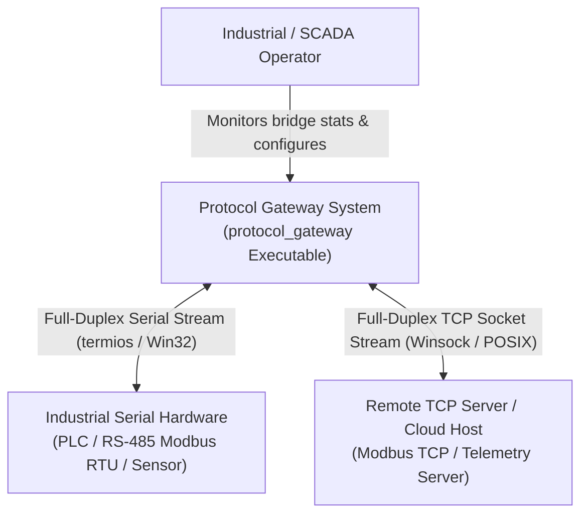
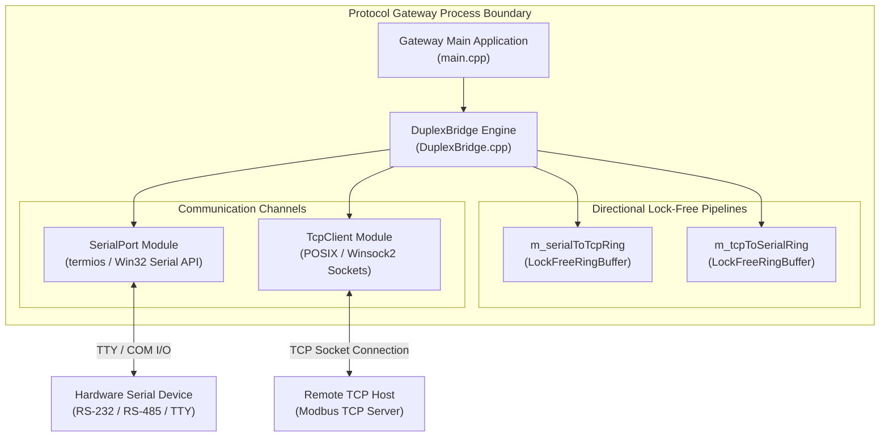
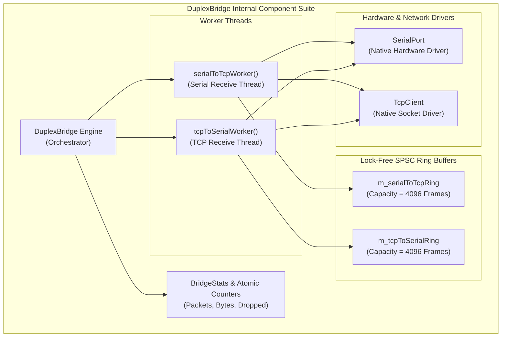
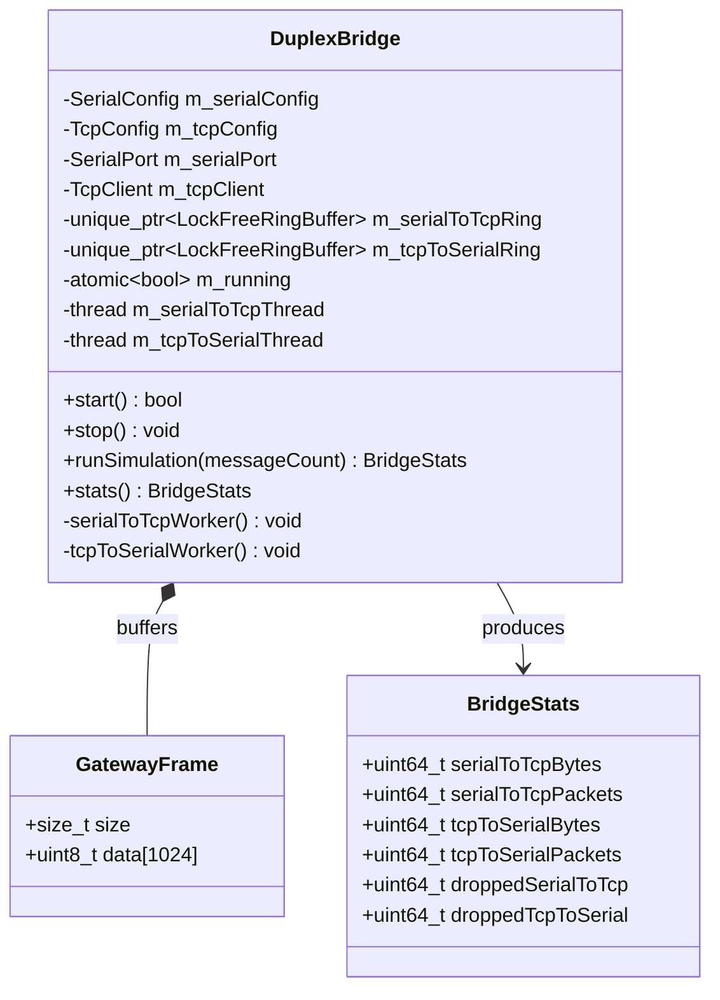

# C4 Architecture Model — Low-Latency Protocol Gateway

This document outlines the software architecture for the high-performance, full-duplex **Serial-to-TCP Industrial Protocol Gateway** (`protocol_gateway`) using the **C4 Model** (Context, Containers, Components, and Code). It includes both **ASCII** and **Mermaid** diagrams for each architectural level.

---

## 1. System Context Diagram (Level 1)

The System Context diagram illustrates how SCADA operators, field serial devices, and remote TCP servers interact with the Protocol Gateway System.

### ASCII Diagram

```
+------------------------+                             +------------------------+
| Industrial Operator /  |                             | Remote SCADA / Cloud   |
| Field Technician       |                             | Central Control Server |
+------------------------+                             +------------------------+
            │                                                      │
            │ Configures & Monitors                                │ Communicates over TCP
            ▼                                                      ▼
+---------------------------------------------------------------------------------------+
| Low-Latency Full-Duplex Protocol Gateway (protocol_gateway)                           |
+---------------------------------------------------------------------------------------+
            │
            │ Communicates over Serial (RS-232 / RS-485 / Modbus RTU)
            ▼
+---------------------------------------------------------------------------------------+
| Industrial Field Device (PLC, Sensor Array, Microcontroller, RTU)                     |
+---------------------------------------------------------------------------------------+
```

### Mermaid Diagram



---

## 2. Container Diagram (Level 2)

The Container diagram illustrates the high-level process boundary, library components, hardware devices, and network sockets comprising the Gateway subsystem.

### ASCII Diagram

```
+-----------------------------------------------------------------------------------------+
| Protocol Gateway Subsystem Boundary                                                     |
|                                                                                         |
|  +-----------------------------------------------------------------------------------+  |
|  | Protocol Gateway Executable (protocol_gateway)                                    |  |
|  |                                                                                   |  |
|  |  +─────────────────────────+                   +───────────────────────────────+  |  |
|  |  | serialToTcpWorker       |                   | tcpToSerialWorker             |  |  |
|  |  | (Thread 1)              |                   | (Thread 2)                    |  |  |
|  |  +─────────────────────────+                   +───────────────────────────────+  |  |
|  |               │                                                │                  |  |
|  |               ▼                                                ▼                  |  |
|  |  +─────────────────────────+                   +───────────────────────────────+  |  |
|  |  | m_serialToTcpRing       |                   | m_tcpToSerialRing             |  |  |
|  |  | (LockFreeRingBuffer)    |                   | (LockFreeRingBuffer)          |  |  |
|  |  +─────────────────────────+                   +───────────────────────────────+  |  |
|  |                                                                                   |  |
|  +────────────────────────────────────────┼──────────────────────────────────────────+  |
|                                           │                                             |
|                    ┌──────────────────────┴──────────────────────┐                      |
|                    ▼                                             ▼                      |
|         +─────────────────────+                       +─────────────────────+           |
|         | SerialPort Hardware |                       | Remote TCP Server   |           |
|         | (/dev/ttyUSB0)      |                       | (192.168.1.100:502) |           |
|         +─────────────────────+                       +─────────────────────+           |
+-----------------------------------------------------------------------------------------+
```

### Mermaid Diagram



---

## 3. Component Diagram (Level 3)

The Component diagram shows the internal C++ class components, lock-free queues, and worker threads within `protocol_gateway`.

### ASCII Diagram

```
+-----------------------------------------------------------------------------------+
| protocol_gateway Component Architecture                                           |
|                                                                                   |
|                   +------------------------------------------+                    |
|                   | DuplexBridge Engine                      |                    |
|                   +------------------------------------------+                    |
|                        │                                │                         |
|      ┌─────────────────┘                                └─────────────────┐       |
|      ▼                                                                    ▼       |
| +─────────────────────────+                            +────────────────────────+ |
| | SerialPort              |                            | TcpClient              | |
| +─────────────────────────+                            +────────────────────────+ |
|      │                                                                    │       |
|      ▼                                                                    ▼       |
| +─────────────────────────+                            +────────────────────────+ |
| | serialToTcpWorker       |                            | tcpToSerialWorker      | |
| | (Serial -> TCP Thread)  |                            | (TCP -> Serial Thread) | |
| +─────────────────────────+                            +────────────────────────+ |
|      │                                                                    │       |
|      ▼                                                                    ▼       |
| +─────────────────────────+                            +────────────────────────+ |
| | m_serialToTcpRing       |                            | m_tcpToSerialRing      | |
| | (LockFreeRingBuffer)    |                            | (LockFreeRingBuffer)   | |
| +─────────────────────────+                            +────────────────────────+ |
+-----------------------------------------------------------------------------------+
```

### Mermaid Diagram



---

## 4. Code & Data Model Diagram (Level 4)

The Code diagram details data structures, configuration options, and class relationships.

### Data Structures (`GatewayFrame.h` & `DuplexBridge.h`)

```cpp
struct GatewayFrame {
    std::size_t size {0};
    uint8_t data[1024] {0}; // Fixed 1KB payload chunk
};

struct BridgeStats {
    uint64_t serialToTcpBytes {0};
    uint64_t serialToTcpPackets {0};
    uint64_t tcpToSerialBytes {0};
    uint64_t tcpToSerialPackets {0};
    uint64_t droppedSerialToTcp {0};
    uint64_t droppedTcpToSerial {0};
};
```

### Class Inheritance & Data Flow



---

## 5. File References 🔗

- Main Executable CLI Entry: [`protocol_gateway/main.cpp`](../protocol_gateway/main.cpp)
- Bridge Header: [`protocol_gateway/DuplexBridge.h`](../protocol_gateway/DuplexBridge.h)
- Bridge Implementation: [`protocol_gateway/DuplexBridge.cpp`](../protocol_gateway/DuplexBridge.cpp)
- Payload Structure: [`protocol_gateway/GatewayFrame.h`](../protocol_gateway/GatewayFrame.h)
- Serial Driver: [`lib/SerialPort.h`](../lib/SerialPort.h)
- TCP Driver: [`lib/TcpClient.h`](../lib/TcpClient.h)
- Lock-Free Ring Buffer: [`lib/LockFreeRingBuffer.h`](../lib/LockFreeRingBuffer.h)
