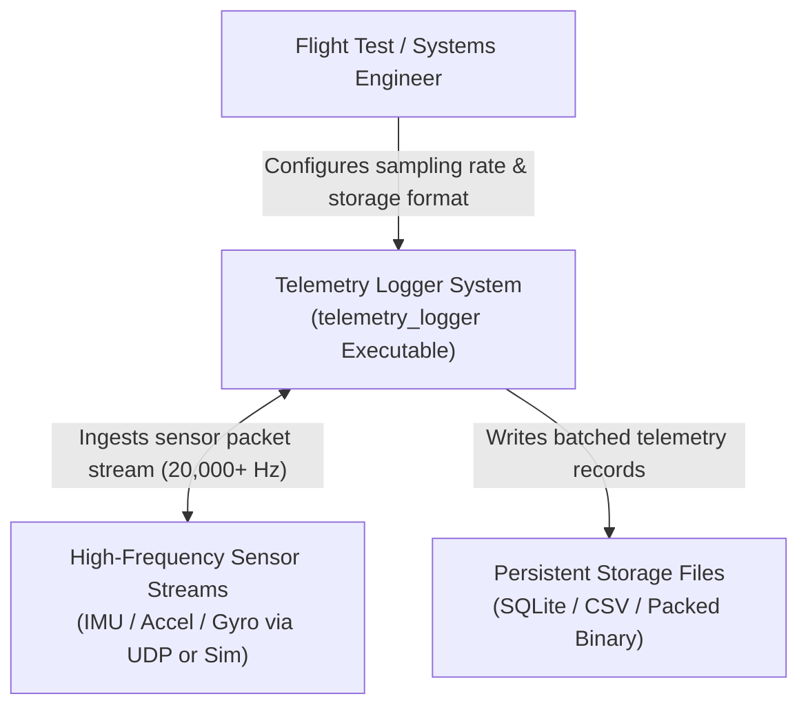
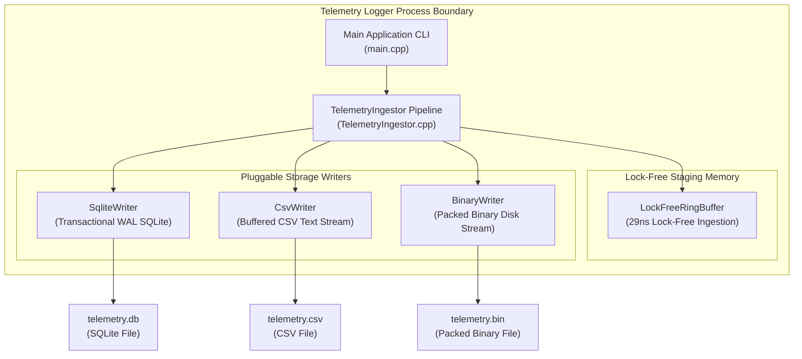
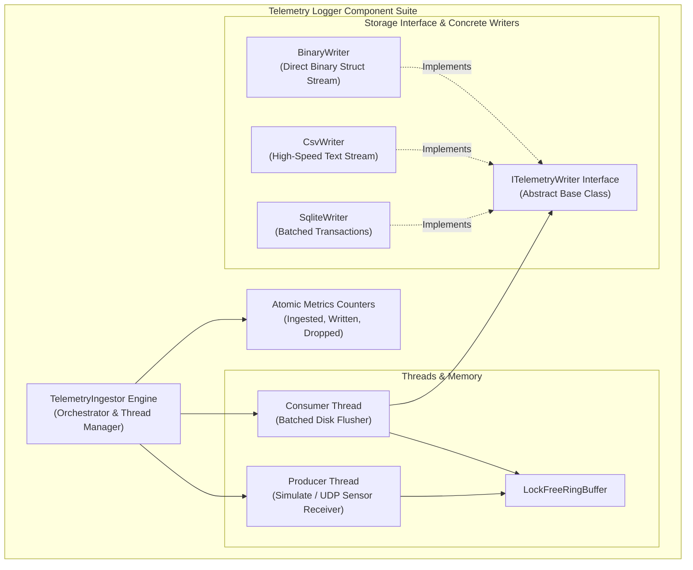
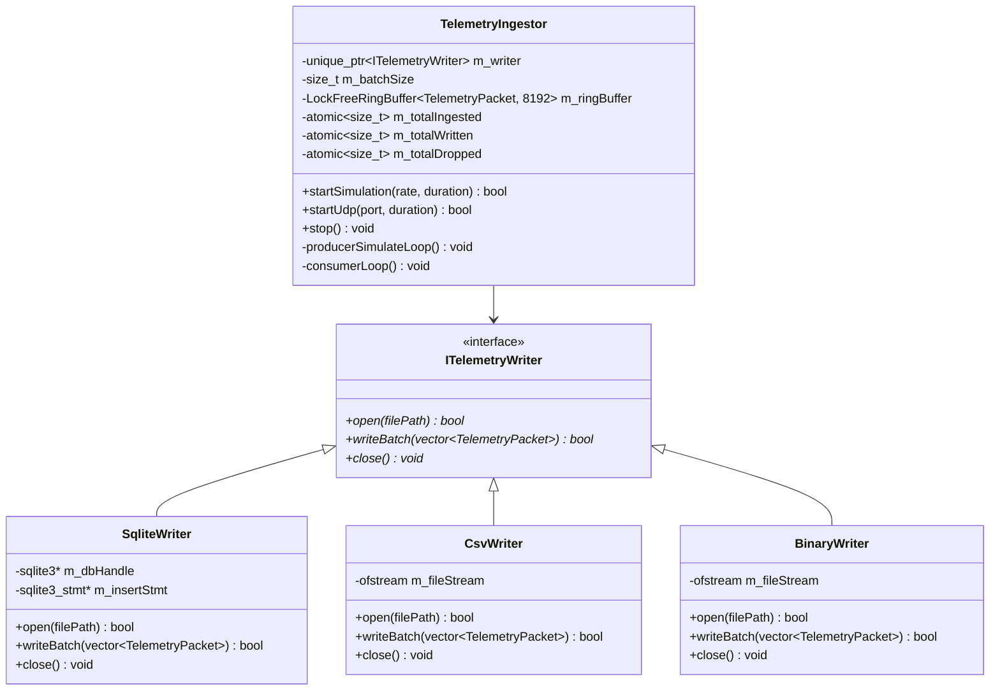

# C4 Architecture Model — High-Frequency Telemetry Logger

This document outlines the software architecture for the **High-Frequency Telemetry Ingestion & Logging Suite** (`telemetry_logger`) using the **C4 Model** (Context, Containers, Components, and Code). It includes both **ASCII** and **Mermaid** diagrams for each architectural level.

---

## 1. System Context Diagram (Level 1)

The System Context diagram illustrates how test engineers, high-frequency sensors, and persistent data sinks interact with the Telemetry Logger System.

### ASCII Diagram

```
+------------------------+                             +------------------------+
| Flight Test Engineer / |                             | Data Analyst /         |
| Telemetry Technician   |                             | Ground Control Station |
+------------------------+                             +------------------------+
            │                                                      │
            │ Configures & Starts Logging                          │ Analyzes Logged Files
            ▼                                                      ▼
+---------------------------------------------------------------------------------------+
| High-Frequency Telemetry Logger System (telemetry_logger)                             |
+---------------------------------------------------------------------------------------+
            │
            │ Ingests 20,000+ Sensor Samples / Sec (IMU, Accel, Gyro, Temp)
            ▼
+---------------------------------------------------------------------------------------+
| High-Frequency Sensor Stream (UDP Unicast/Broadcast Sockets or Simulator)             |
+---------------------------------------------------------------------------------------+
```

### Mermaid Diagram



---

## 2. Container Diagram (Level 2)

The Container diagram shows the process boundary, lock-free ring buffer pipeline, and storage writer containers within the Telemetry Logger subsystem.

### ASCII Diagram

```
+-----------------------------------------------------------------------------------------+
| Telemetry Logger Subsystem Boundary                                                     |
|                                                                                         |
|  +-----------------------------------------------------------------------------------+  |
|  | Telemetry Logger Application (telemetry_logger)                                   |  |
|  |                                                                                   |  |
|  |  +─────────────────────────+                   +───────────────────────────────+  |  |
|  |  | producerSimulateLoop()  |                   | consumerLoop()                |  |  |
|  |  | (Producer Thread)       |                   | (Consumer Thread)             |  |  |
|  |  +─────────────────────────+                   +───────────────────────────────+  |  |
|  |               │                                                │                  |  |
|  |               ▼                                                ▼                  |  |
|  |  +─────────────────────────────────────────────────────────────────────────────+  |  |
|  |  | m_ringBuffer (LockFreeRingBuffer<TelemetryPacket, 8192>)                    |  |  |
|  |  +─────────────────────────────────────────────────────────────────────────────+  |  |
|  |                                                                                   |  |
|  +────────────────────────────────────────┼──────────────────────────────────────────+  |
|                                           │                                             |
|                    ┌──────────────────────┼──────────────────────┐                      |
|                    ▼                      ▼                      ▼                      |
|         +───────────────────+  +───────────────────+  +───────────────────+             |
|         | SQLite Database   |  | CSV File          |  | Binary File       |             |
|         | (telemetry.db)    |  | (telemetry.csv)   |  | (telemetry.bin)   |             |
|         +───────────────────+  +───────────────────+  +───────────────────+             |
+-----------------------------------------------------------------------------------------+
```

### Mermaid Diagram



---

## 3. Component Diagram (Level 3)

The Component diagram details the internal C++ class architecture and batching mechanisms of `telemetry_logger`.

### ASCII Diagram

```
+-----------------------------------------------------------------------------------+
| telemetry_logger Component Architecture                                           |
|                                                                                   |
|  +-----------------------------------------------------------------------------+  |
|  | TelemetryIngestor Pipeline Engine                                           |  |
|  +-----------------------------------------------------------------------------+  |
|        │                                                                │         |
|        │ Producer Thread                                                │ Consumer|
|        ▼                                                                ▼         |
|  +─────────────────────────+                            +───────────────────────+ |
|  | LockFreeRingBuffer      |                            | ITelemetryWriter      | |
|  | (Capacity = 8192)       |                            | Interface             | |
|  +─────────────────────────+                            +───────────────────────+ |
|                                                                     │             |
|                                     ┌───────────────────────────────┼──────────┐  |
|                                     ▼                               ▼          ▼  |
|                         +───────────────────────+       +───────────────+ +─────+ |
|                         | SqliteWriter          |       | CsvWriter     | |Bin..| |
|                         | (SQLite Batch WAL)    |       | (CSV Stream)  | |Writer| |
|                         +───────────────────────+       +───────────────+ +─────+ |
+-----------------------------------------------------------------------------------+
```

### Mermaid Diagram



---

## 4. Code & Data Model Diagram (Level 4)

The Code diagram details data packet structures, interface contracts, and storage writer class relationships.

### Data Structures (`TelemetryTypes.h`)

```cpp
struct TelemetryPacket {
    uint64_t timestampNs {0}; // Timestamp (Nanoseconds)
    char sensorId[16] {0};    // Sensor String ID (e.g. "IMU_01")
    float accelX {0.0f};      // Acceleration X (g or m/s^2)
    float accelY {0.0f};      // Acceleration Y
    float accelZ {0.0f};      // Acceleration Z
    float gyroX {0.0f};       // Angular Velocity X (rad/s or deg/s)
    float gyroY {0.0f};       // Angular Velocity Y
    float gyroZ {0.0f};       // Angular Velocity Z
    float temperature {0.0f}; // Temperature (Celsius)
};
```

### Class Inheritance & Relationships



---

## 5. File References 🔗

- Main Executable Entry: [`telemetry_logger/main.cpp`](../telemetry_logger/main.cpp)
- Ingestion Engine Header: [`telemetry_logger/TelemetryIngestor.h`](../telemetry_logger/TelemetryIngestor.h)
- Ingestion Engine Source: [`telemetry_logger/TelemetryIngestor.cpp`](../telemetry_logger/TelemetryIngestor.cpp)
- Packet Structures: [`telemetry_logger/TelemetryTypes.h`](../telemetry_logger/TelemetryTypes.h)
- Writer Interface: [`telemetry_logger/ITelemetryWriter.h`](../telemetry_logger/ITelemetryWriter.h)
- SQLite Writer: [`telemetry_logger/SqliteWriter.h`](../telemetry_logger/SqliteWriter.h)
- CSV Writer: [`telemetry_logger/CsvWriter.h`](../telemetry_logger/CsvWriter.h)
- Binary Writer: [`telemetry_logger/BinaryWriter.h`](../telemetry_logger/BinaryWriter.h)
- Lock-Free Ring Buffer: [`lib/LockFreeRingBuffer.h`](../lib/LockFreeRingBuffer.h)
