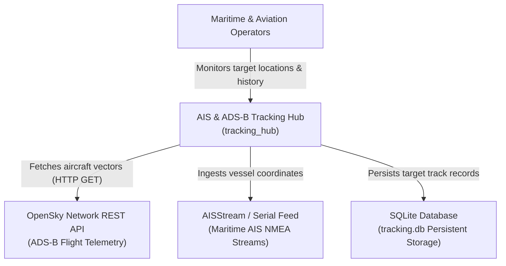
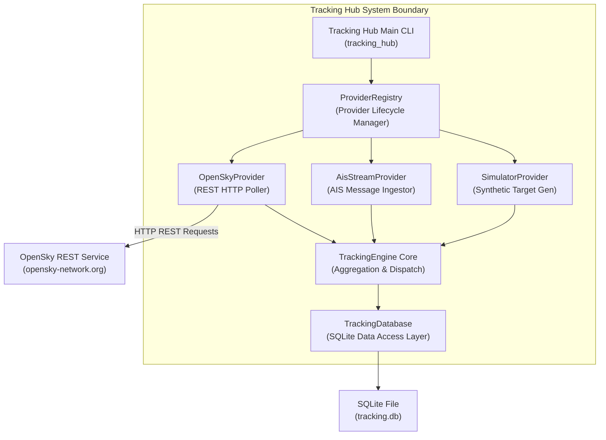
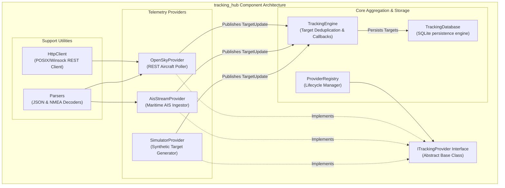
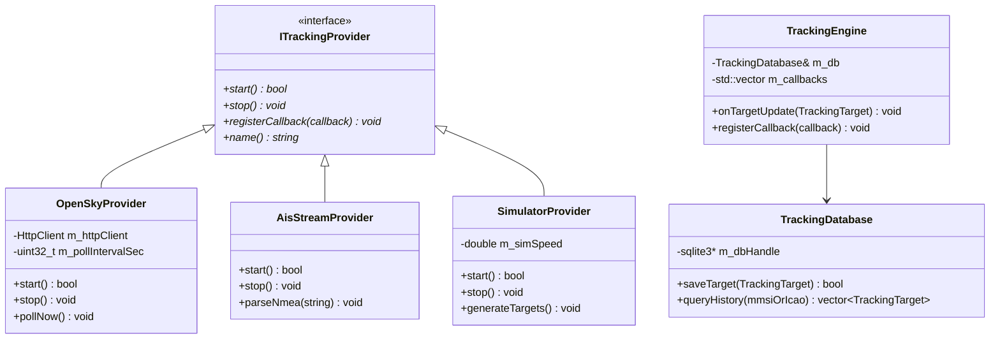

# C4 Architecture Model — AIS & ADS-B Telemetry Tracking Hub

This document details the software architecture for the high-frequency **AIS (Maritime) & ADS-B (Aviation) Telemetry Tracking Hub** (`tracking_hub`) using the **C4 Model** (Context, Containers, Components, and Code). It provides both **ASCII** and **Mermaid** diagrams for each architectural level.

---

## 1. System Context Diagram (Level 1)

The System Context diagram shows how external telemetry providers, human operators, and storage sinks interact with the Tracking Hub system.

### ASCII Diagram

```
+---------------------+        +--------------------+        +-----------------------+
|  Maritime Operator  |        | Aviation Observer  |        | System Administrator  |
+---------------------+        +--------------------+        +-----------------------+
           │                             │                              │
           └─────────────────────────────┼──────────────────────────────┘
                                         │
                                         ▼
                 +-----------------------------------------------+
                 | AIS & ADS-B Telemetry Tracking Hub            |
                 | (tracking_hub Executable)                     |
                 +-----------------------------------------------+
                                         │
        ┌────────────────────────────────┼────────────────────────────────┐
        │                                │                                │
        ▼                                ▼                                ▼
+──────────────────+           +──────────────────+           +──────────────────+
| OpenSky Network  |           | AISStream Feed   |           | Persistent DB    |
| (ADS-B REST API) |           | (Maritime NMEA)  |           | (SQLite Storage) |
+──────────────────+           +──────────────────+           +──────────────────+
```

### Mermaid Diagram



---

## 2. Container Diagram (Level 2)

The Container diagram illustrates the runtime executables, libraries, data stores, and external protocol interfaces comprising the Tracking Hub subsystem.

### ASCII Diagram

```
+-----------------------------------------------------------------------------------------+
| Tracking Hub Subsystem Boundary                                                         |
|                                                                                         |
|  +-----------------------------------------------------------------------------------+  |
|  | Tracking Hub CLI Application (tracking_hub)                                       |  |
|  |                                                                                   |  |
|  |  +-----------------------+  +------------------------+  +----------------------+  |  |
|  |  | OpenSkyProvider       |  | AisStreamProvider      |  | SimulatorProvider    |  |  |
|  |  +-----------------------+  +------------------------+  +----------------------+  |  |
|  |              │                          │                          │              |  |
|  |              └──────────────────────────┼──────────────────────────┘              |  |
|  |                                         ▼                                         |  |
|  |                             +-----------------------+                             |  |
|  |                             | TrackingEngine        |                             |  |
|  |                             +-----------------------+                             |  |
|  |                                         │                                         |  |
|  +─────────────────────────────────────────┼─────────────────────────────────────────+  |
|                                            │                                            |
|                                            ▼                                            |
|                                +───────────────────────+                                |
|                                | SQLite Database       |                                |
|                                | (tracking.db)         |                                |
|                                +───────────────────────+                                |
+-----------------------------------------------------------------------------------------+
```

### Mermaid Diagram



---

## 3. Component Diagram (Level 3)

The Component diagram reveals the internal C++ class components within the `tracking_hub` executable.

### ASCII Diagram

```
+-----------------------------------------------------------------------------------+
| tracking_hub Executable Internal Architecture                                     |
|                                                                                   |
|  +----------------------+      +----------------------+     +------------------+  |
|  | HttpClient           | ───> | OpenSkyProvider      | ──┐ | SimulatorProvider|  |
|  +----------------------+      +----------------------+   │ +------------------+  |
|                                                           │          │            |
|  +----------------------+      +----------------------+   │          │            |
|  | Parsers              | ───> | AisStreamProvider    | ──┼──────────┘            |
|  +----------------------+      +----------------------+   │                       |
|                                                           ▼                       |
|                                                +──────────────────────+           |
|                                                | ITrackingProvider    |           |
|                                                +──────────────────────+           |
|                                                           │                       |
|                                                           ▼                       |
|                                                +──────────────────────+           |
|                                                | ProviderRegistry     |           |
|                                                +──────────────────────+           |
|                                                           │                       |
|                                                           ▼                       |
|                                                +──────────────────────+           |
|                                                | TrackingEngine       |           |
|                                                +──────────────────────+           |
|                                                           │                       |
|                                                           ▼                       |
|                                                +──────────────────────+           |
|                                                | TrackingDatabase     |           |
|                                                +──────────────────────+           |
+-----------------------------------------------------------------------------------+
```

### Mermaid Diagram



---

## 4. Code & Data Model Diagram (Level 4)

The Code diagram details the core data structures and C++ class contracts driving target processing.

### Data Model & Structs (`TargetTypes.h`)

```cpp
enum class TargetType {
    AisTarget,   // Maritime vessel (MMSI)
    AdsbTarget   // Aircraft (ICAO 24-bit transponder)
};

struct TrackingTarget {
    std::string mmsiOrIcao;  // Unique identifier
    TargetType type;         // Maritime or Aviation
    double latitude;         // WGS84 Latitude
    double longitude;        // WGS84 Longitude
    double speed;            // Knots or Airspeed
    double heading;          // True Heading (Degrees)
    double altitude;         // Feet (ADS-B) or 0 (AIS)
    uint64_t timestamp;      // Epoch Milliseconds
    std::string callsign;    // Vessel Name or Flight Callsign
};
```

### Class Inheritance & Relationships



---

## 5. File References 🔗

- Header Interface: [`tracking_hub/ITrackingProvider.h`](../tracking_hub/ITrackingProvider.h)
- Data Structures: [`tracking_hub/TargetTypes.h`](../tracking_hub/TargetTypes.h)
- OpenSky Provider: [`tracking_hub/OpenSkyProvider.h`](../tracking_hub/OpenSkyProvider.h)
- AIS Provider: [`tracking_hub/AisStreamProvider.h`](../tracking_hub/AisStreamProvider.h)
- Simulator Provider: [`tracking_hub/SimulatorProvider.h`](../tracking_hub/SimulatorProvider.h)
- Registry: [`tracking_hub/ProviderRegistry.h`](../tracking_hub/ProviderRegistry.h)
- Tracking Engine: [`tracking_hub/TrackingEngine.h`](../tracking_hub/TrackingEngine.h)
- Database Persistence: [`tracking_hub/TrackingDatabase.h`](../tracking_hub/TrackingDatabase.h)
- Executable Main Entry: [`tracking_hub/main.cpp`](../tracking_hub/main.cpp)
