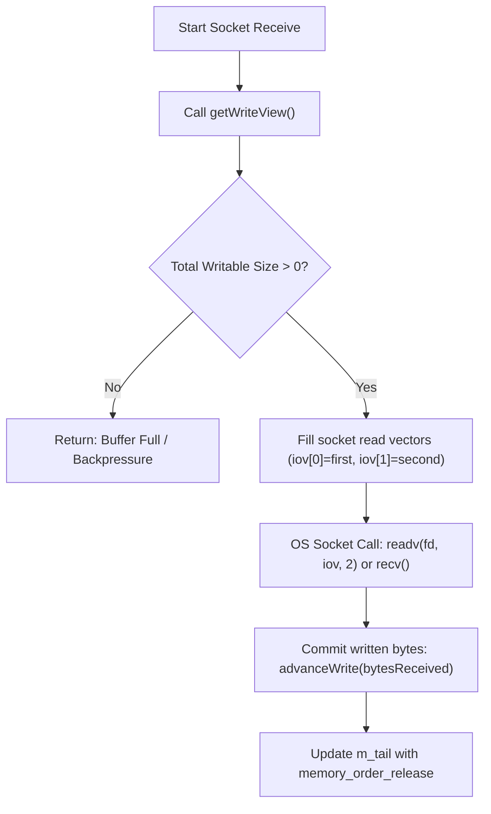
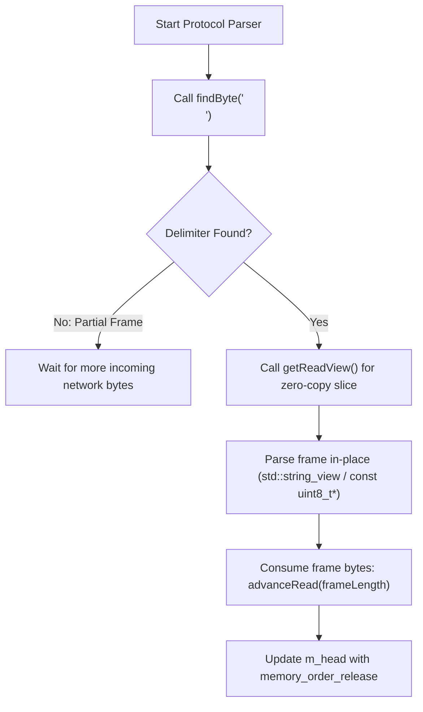
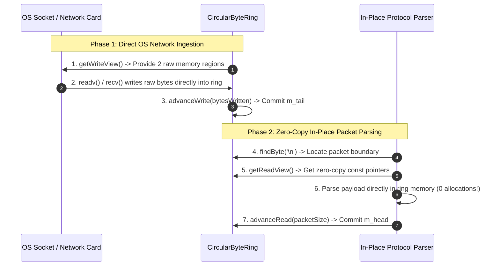

# Circular Byte Ring: Explained Like I'm 5 (ELI5)

This document provides a beginner-friendly, visual explanation of the **Single-Producer Single-Consumer (SPSC) Zero-Copy Circular Byte Stream Ring** (`CircularByteRing<Capacity>`) implemented in [`lib/CircularByteRing.h`](../lib/CircularByteRing.h).

---

## 1. What is a Circular Byte Ring? 🌊

Imagine a **circular water trough at a farm**:

- **LockFreeRingBuffer**: Moves individual **boxed items** (like whole apples).
- **CircularByteRing**: Handles a continuous **unstructured stream of liquid** (like pumping raw water or network bytes).

```
                 [ Index 0 ]
        [ End ]              [ Region 2 ]
     [ Region 1 ]                 [ Tail ]
        [ Head ]             [ Free ]
                 [ Index Capacity-1 ]
```

### Why "Zero-Copy"?
Normally, when your computer receives network packets from a socket:
1. The OS kernel copies bytes into a temporary buffer.
2. Your program allocates a `std::vector<uint8_t>` on the heap and copies the bytes *again*.
3. A protocol parser copies bytes a *third time* into a string or struct!

With `CircularByteRing`:
- The OS socket (`recv()` or `readv()`) writes bytes **directly into the ring buffer's memory** (`getWriteView()`).
- Your parser inspects bytes **directly in place** (`getReadView()`) without copying a single byte!

---

## 2. Dynamic ASCII Visualizations 🎨

### Scenario A: Single Contiguous Region (No Wrap-Around)
When there is space remaining between `m_tail` and the end of the array, `getWriteView()` or `getReadView()` returns **1 primary region** (`first.size > 0`, `second.size == 0`).

```
              m_head = 2                             m_tail = 7
                  │                                      │
                  ▼                                      ▼
┌──────────┬──────────┬──────────┬──────────┬──────────┬──────────┬──────────┬──────────┐
│  Popped  │  Popped  │  Byte 1  │  Byte 2  │  Byte 3  │  Byte 4  │  Byte 5  │  Free    │
└──────────┴──────────┴──────────┴──────────┴──────────┴──────────┴──────────┴──────────┘
  Slot 0     Slot 1     Slot 2     Slot 3     Slot 4     Slot 5     Slot 6     Slot 7
                        └────────────────────────────────────────┘
                                Read View First Region (Size 5)
```

---

### Scenario B: Two-Region Wrap-Around (Zero-Copy Split)
When readable or writable data spans past the end of the array (`Slot 7`), the circular ring seamlessly splits the memory into **2 contiguous regions**:
- **`first` region**: From `m_tail` (or `m_head`) to the end of the array.
- **`second` region**: From `Slot 0` to the remainder.

```
                                  m_head = 6                       m_tail = 11 (Idx 3)
                                      │                                 │
                                      ▼                                 ▼
┌──────────┬──────────┬──────────┬──────────┬──────────┬──────────┬──────────┬──────────┐
│  Byte 3  │  Byte 4  │  Popped  │  Popped  │  Popped  │  Popped  │  Byte 1  │  Byte 2  │
└──────────┴──────────┴──────────┴──────────┴──────────┴──────────┴──────────┴──────────┘
  Slot 0     Slot 1     Slot 2     Slot 3     Slot 4     Slot 5     Slot 6     Slot 7
 └───────────────────┘                                             └───────────────────┘
   Second Region (Size 2)                                            First Region (Size 2)
```

---

### Scenario C: Fast In-Place Delimiter Search (`findByte('\n')`)
When parsing streaming protocols (like NMEA 0183 GPS sentences `"$GPGGA... \r\n"` or HTTP headers), we need to find delimiter bytes like `'\n'` without copying.

`CircularByteRing::findByte(delimiter)` uses hardware-accelerated `std::memchr` across `first` and `second` regions:

```
  Search Region 1 (memchr) ──> Not Found!
  Search Region 2 (memchr) ──> Found '\n' at Offset 3!

                        Read Head
                            │
                            ▼
┌──────────┬──────────┬──────────┬──────────┬──────────┬──────────┬──────────┬──────────┐
│  Data    │  Data    │   '\n'   │  Data    │  Popped  │  Popped  │  $GPGGA  │  ,123519 │
└──────────┴──────────┴──────────┴──────────┴──────────┴──────────┴──────────┴──────────┘
  Slot 0     Slot 1     Slot 2     Slot 3     Slot 4     Slot 5     Slot 6     Slot 7
                        ▲                                          └───────────────────┘
                        │                                             Region 1 Search
                  Delimiter Found!
```

---

## 3. Operations Workflow (Mermaid Diagrams) 📊

### Two-Phase Zero-Copy Receive (Producer Thread)



### Two-Phase In-Place Parsing (Consumer Thread)



---

### End-to-End Zero-Copy Socket Pipeline



---

## 4. Key Performance Features 🚀

### 1. Zero Heap Allocations & Zero Copying
By giving the OS network stack direct pointers to its internal array via `ZeroCopyWriteView`, `CircularByteRing` eliminates dynamic heap allocation (`malloc`/`new`) and extra memory copying in high-throughput network receive loops.

### 2. $O(1)$ Bitwise Index Masking
Because `Capacity` is strictly validated to be a power of 2:

$$\text{Index} = \text{Counter} \ \& \ (\text{Capacity} - 1)$$

Index calculations bypass expensive division/modulo operations on every byte.

### 3. Hardware-Accelerated Delimiter Search
`findByte()` utilizes SIMD-optimized C runtime functions (`std::memchr`) to scan gigabytes of byte streams per second for message boundaries.

### 4. Cache Line Isolation (`alignas(64)`)
In [`lib/CircularByteRing.h`](../lib/CircularByteRing.h#L292-L294):
```cpp
alignas(64) std::atomic<std::size_t> m_head;
alignas(64) std::atomic<std::size_t> m_tail;
alignas(64) std::array<uint8_t, Capacity> m_buffer;
```
Ensures producer socket threads and consumer parsing threads never suffer from CPU false sharing.

---

## 5. Summary Feature Comparison 📋

| Feature | Standard `std::vector` / `std::string` Staging | `CircularByteRing<Capacity>` |
|---|---|---|
| **Network Read** | Copy kernel bytes -> staging buffer -> application | **Direct OS socket write into ring (`readv`)** |
| **Heap Allocations** | Dynamic (`new`/`realloc` on every frame) | **Zero (Pre-allocated stack/static array)** |
| **Parsing Strategy** | Copy bytes into standalone message objects | **In-place inspection (`std::string_view`)** |
| **Delimiter Search** | Linear loop or string search | **Hardware-accelerated `std::memchr`** |
| **Synchronization** | `std::mutex` locks | **Lock-Free Atomic SPSC (`acquire`/`release`)** |

---

## 6. Implementation Reference 🔗

- Header: [`lib/CircularByteRing.h`](../lib/CircularByteRing.h)
- Unit Tests: [`tests/unit_tests.cpp`](../tests/unit_tests.cpp)
- Benchmark: [`benchmark/lockfree_benchmark.cpp`](../benchmark/lockfree_benchmark.cpp)

---

## 7. External References & Further Reading 📚

1. **Linux Kernel `kfifo` Byte Ring Buffer** — [Linux Kernel Documentation](https://www.kernel.org/doc/htmldocs/kernel-api/kfifo.html)
   - *Source: `include/linux/kfifo.h` — The classic Linux kernel lock-free circular byte buffer design.*
2. **Scatter/Gather I/O (`readv` / `writev`)** — [POSIX IEEE Std 1003.1](https://pubs.opengroup.org/onlinepubs/9699919799/functions/readv.html)
   - *Official specification for zero-copy multi-region vector network socket I/O.*
3. **Lock-Free Byte Streams & Ring Buffers** — Dmitry Vyukov (1024cores)
   - Direct Link: [1024cores SPSC Byte Ring & Queue Catalog](https://sites.google.com/site/1024cores/home/lock-free-algorithms/queues/queue-catalog)
4. **C++ `std::memchr` SIMD Byte Search** — [cppreference.com](https://en.cppreference.com/w/cpp/string/byte/memchr)
   - *Official ISO C++ reference for fast C-style byte array scanning.*
