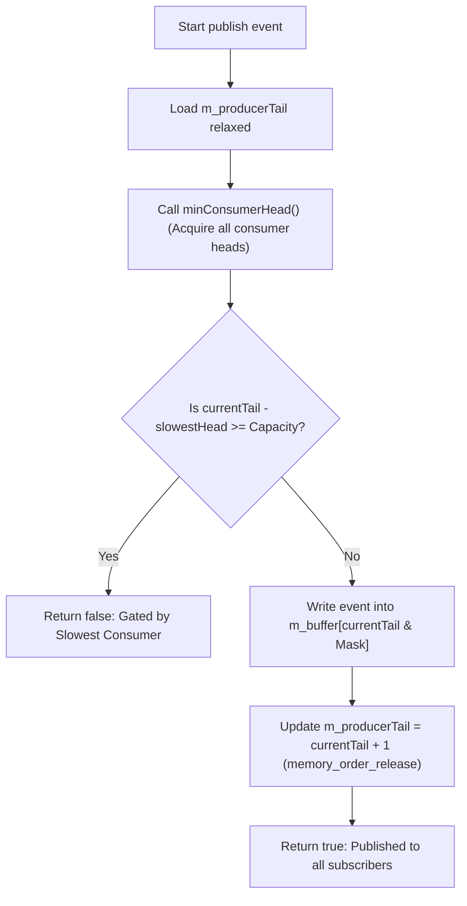
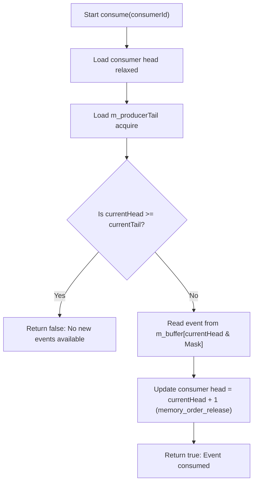
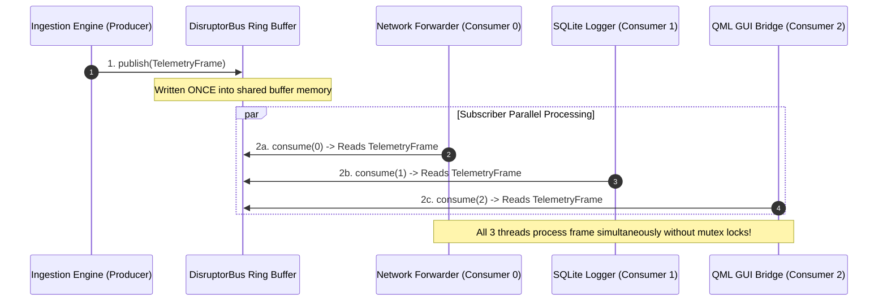

# Disruptor Event Bus: Explained Like I'm 5 (ELI5)

This document provides a beginner-friendly, visual explanation of the **Single-Producer Multi-Consumer (SPMC) Lock-Free Broadcast Bus** (`DisruptorBus<T, Capacity, ConsumerCount>`) implemented in [`lib/DisruptorBus.h`](../lib/DisruptorBus.h).

---

## 1. What is the Disruptor Event Bus? 📰

Imagine a **Newspaper Printing Press and 4 Independent Readers**:

- **Printing Press (Producer Thread)**: Prints numbered newspaper issues (Event Frames) into a shared rack.
- **Readers A, B, C, D (Subscriber Consumer Threads)**: Read newspaper issues independently at their own speed.

```
                  [ Issue 0 ]
        [ Issue 7 ]         [ Issue 1 ]
   [ Issue 6 ]                   [ Issue 2 ]  <-- Slow Reader C is here
        [ Issue 5 ]         [ Issue 3 ]
                  [ Issue 4 ]                 <-- Fast Reader A & Press are here
```

### Why "Disruptor Pattern"?
In traditional messaging systems (like `std::vector` or queues with locks):
1. A producer duplicates every message 4 times so each subscriber gets a private copy.
2. Every subscriber grabs a **padlock (Mutex)**, causing massive CPU contention.

With the **LMAX Disruptor Pattern**:
- **Zero Memory Duplication**: The Producer writes the event **once** into a shared ring buffer.
- **Independent Reading**: Each subscriber thread tracks its own reading progress (`head` index).
- **Slowest-Consumer Gating**: The Printing Press checks the slowest reader's bookmark before printing. It will never overwrite an issue until **all 4 readers** have finished reading it!

---

## 2. Dynamic ASCII Visualizations 🎨

### Scenario A: Multi-Consumer Broadcast Ring
The Producer has published 6 events (`m_producerTail = 6`). Three subscriber threads read independently:
- **Consumer 0 (Fast Network Forwarder)**: At `head = 5` (Reading `Event 5`).
- **Consumer 1 (Database Logger)**: At `head = 5` (Reading `Event 5`).
- **Consumer 2 (Slow GUI Renderer)**: At `head = 2` (Reading `Event 2`).

```
                Consumer 2 Head = 2                     Consumer 0 & 1 Head = 5
                        │                                  Producer Tail = 6
                        │                                          │
                        ▼                                          ▼
┌──────────┬──────────┬──────────┬──────────┬──────────┬──────────┬──────────┬──────────┐
│  Event 0 │  Event 1 │  Event 2 │  Event 3 │  Event 4 │  Event 5 │  Free    │  Free    │
└──────────┴──────────┴──────────┴──────────┴──────────┴──────────┴──────────┴──────────┘
  Slot 0     Slot 1     Slot 2     Slot 3     Slot 4     Slot 5     Slot 6     Slot 7
```

---

### Scenario B: Slowest-Consumer Gating (`minConsumerHead()`)
What happens when the Producer reaches `m_producerTail = 10` in an 8-slot ring buffer (`Capacity = 8`)?

The Producer calls `minConsumerHead()`:
- `Consumer 0 Head = 9`
- `Consumer 1 Head = 9`
- `Consumer 2 Head = 2` (Slowest Reader!)

Calculated difference: $\text{Tail} - \text{SlowestHead} = 10 - 2 = 8 \ge \text{Capacity}$.

```
                 Slowest Head = 2 (Consumer 2)         Producer Tail = 10 (Idx 2)
                        │                                          │
                        ▼                                          ▼
┌──────────┬──────────┬──────────┬──────────┬──────────┬──────────┬──────────┬──────────┐
│  Event 8 │  Event 9 │  BLOCKED │  Event 3 │  Event 4 │  Event 5 │  Event 6 │  Event 7 │
└──────────┴──────────┴──────────┴──────────┴──────────┴──────────┴──────────┴──────────┘
  Slot 0     Slot 1     Slot 2     Slot 3     Slot 4     Slot 5     Slot 6     Slot 7
                        ▲
                        │
      STOP! Producer cannot overwrite Slot 2 until Consumer 2 reads it!
```

---

## 3. Operations Workflow (Mermaid Diagrams) 📊

### Producer Publish Workflow (`publish(event)`)



### Consumer Read Workflow (`consume(consumerId, outEvent)`)



---

### Broadcast Pipeline Architecture (1 Producer to N Subscribers)



---

## 4. Hardware Optimization & Mechanical Sympathy 🚀

### 1. Per-Consumer Cache Line Isolation (`alignas(64)`)
If 4 consumer threads update their `head` indices in adjacent memory addresses, the CPU cores will constantly bounce cache lines back and forth (**False Sharing**).

In [`lib/DisruptorBus.h`](../lib/DisruptorBus.h#L196-L203):
```cpp
struct alignas(64) ConsumerSequence {
    std::atomic<std::size_t> head {0};
};

alignas(64) std::atomic<std::size_t> m_producerTail;
alignas(64) std::array<ConsumerSequence, ConsumerCount> m_consumerHeads;
alignas(64) std::array<T, Capacity> m_buffer;
```
Each consumer head gets its own dedicated **64-byte L1 Cache Line**, allowing 4 subscriber threads to process events at full CPU frequency!

### 2. Zero Memory Allocation & Zero Copying
- No dynamic memory allocation (`malloc`/`new`) when broadcasting frames.
- Events are stored in pre-allocated array memory (`std::array<T, Capacity>`).

### 3. $O(1)$ Bitwise Ring Masking
Because `Capacity` is a power of 2:

$$\text{Index} = \text{Counter} \ \& \ (\text{Capacity} - 1)$$

---

## 5. Summary Performance Comparison 📋

| Feature | Standard Mutex-Based Queue / Fanout | `DisruptorBus` Broadcast |
|---|---|---|
| **Memory Copies** | Copies event $N$ times for $N$ consumers | **0 copies (Written once, read in-place)** |
| **Synchronization** | `std::mutex` locks / Condition variables | **Lock-Free Atomic Cursors (`acquire`/`release`)** |
| **Throughput** | ~3.4 Million msgs/sec | **~23.69 Million msgs/sec** |
| **False Sharing Safe?** | No guarantee | **Yes (`alignas(64)` per consumer sequence)** |
| **Overflow Handling** | Unbounded growth or blocking locks | **Slowest-Consumer Gating (`minConsumerHead`)** |

---

## 6. Implementation Reference 🔗

- Header: [`lib/DisruptorBus.h`](../lib/DisruptorBus.h)
- Unit Tests: [`tests/unit_tests.cpp`](../tests/unit_tests.cpp)
- Benchmark: [`benchmark/lockfree_benchmark.cpp`](../benchmark/lockfree_benchmark.cpp)

---

## 7. External References & Further Reading 📚

1. **The LMAX Disruptor High-Performance Alternative to Bounded Queues**  
   - Direct Link: [LMAX Disruptor Technical Paper (PDF)](https://lmax-exchange.github.io/disruptor/files/Disruptor-1.0.pdf) | [LMAX Architecture Overview](https://lmax-exchange.github.io/disruptor/)
   - *Technical paper by Martin Thompson, Dave Farley, Michael Barker, Patricia Gee, and Andrew Stewart (2011).*
2. **Mechanical Sympathy: Hardware-Oriented Concurrency** — Martin Thompson  
   - Direct Link: [Mechanical Sympathy Blog](https://mechanical-sympathy.blogspot.com/)
   - *Deep dive into CPU cache coherency, ring buffer mechanics, and false sharing avoidance.*
3. **C++ Atomic Memory Order Specifications (`std::memory_order`)** — cppreference.com  
   - Direct Link: [cppreference: `std::memory_order`](https://en.cppreference.com/w/cpp/atomic/memory_order)
   - *Official ISO C++ reference for atomic acquire/release memory synchronization constraints.*
