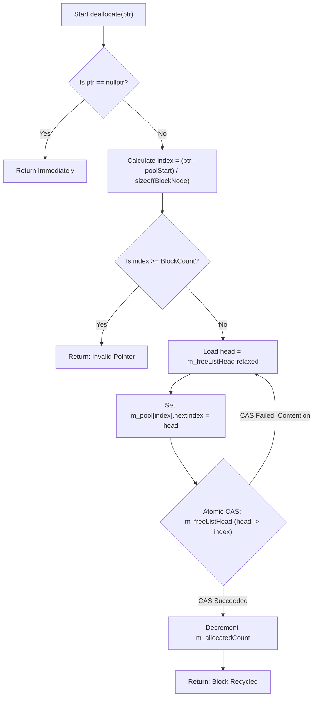
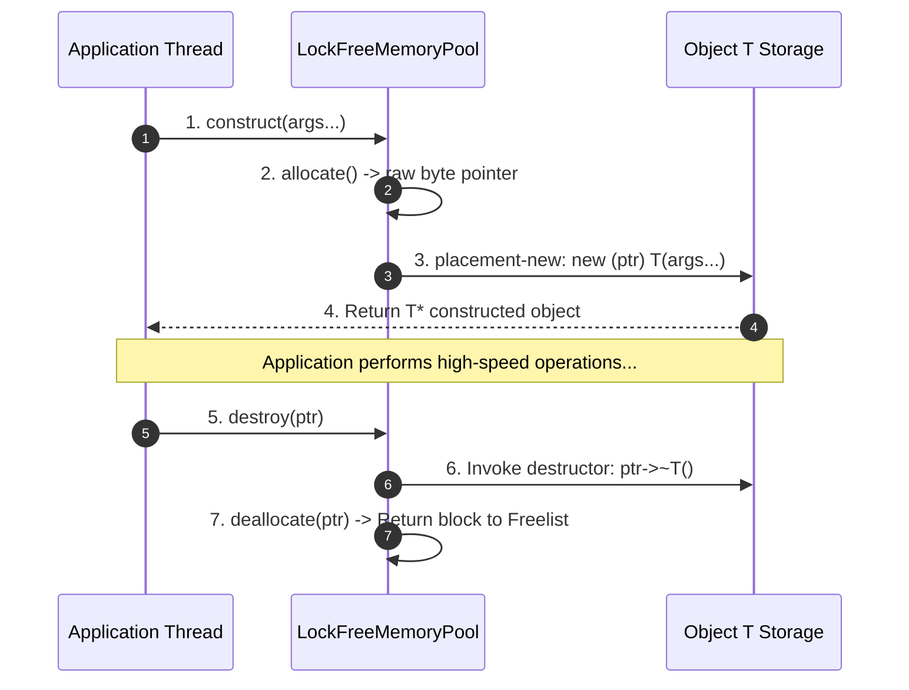

# Lock-Free Memory Pool: Explained Like I'm 5 (ELI5)

This document provides a beginner-friendly, visual explanation of the **Lock-Free Fixed-Block Memory Allocator** (`LockFreeMemoryPool<T, BlockCount>`) implemented in [`lib/LockFreeMemoryPool.h`](../lib/LockFreeMemoryPool.h).

---

## 1. What is a Lock-Free Memory Pool? 🔐

Imagine a **hotel with 1024 identical rooms**:

- **OS `malloc` / `new` (Traditional Approach)**:
  Every time a guest arrives, the hotel manager calls a construction company to build a brand new room, write up a contract, and hand over the key. When the guest leaves, a demolition crew destroys the room! If 50 guests arrive at once, they all queue up outside the manager's office waiting behind a single **padlock (Mutex)**.

- **Lock-Free Memory Pool (Our Approach)**:
  Before the hotel opens, **all 1024 rooms are pre-built** in a single row. The keys are stacked on a special self-service rack (**Atomic Freelist Stack**).
  - When a guest arrives (**`allocate()`**), they grab the top key off the stack using a split-second atomic move.
  - When a guest leaves (**`deallocate()`**), they drop their key back onto the top of the stack.
  - No construction, no demolition, and **zero waiting in line**!

---

## 2. Dynamic ASCII Visualizations 🎨

### Scenario A: Initial State (Freelist Linked Stack)
When the pool is initialized, an array of `BlockNode` structures is pre-allocated. Each node holds its next free index, forming a linked chain: `0 ──> 1 ──> 2 ──> 3 ... ──> invalidIndex`.

```
               m_freeListHead = 0
                       │
                       ▼
         ┌──────────────────────────┐
  Index  │ BlockNode                │    nextIndex
 ─────── ├──────────────────────────┤   ───────────
   [0]   │ nextIndex = 1            │ ─────┐
         │ storage [ sizeof(T) ]    │      │
 ─────── ├──────────────────────────┤ <────┘
   [1]   │ nextIndex = 2            │ ─────┐
         │ storage [ sizeof(T) ]    │      │
 ─────── ├──────────────────────────┤ <────┘
   [2]   │ nextIndex = 3            │ ─────┐
         │ storage [ sizeof(T) ]    │      │
 ─────── ├──────────────────────────┤ <────┘
   ...   │ ...                      │
 ─────── ├──────────────────────────┤
 [1023]  │ nextIndex = invalidIndex │ ─────> (End of Stack)
         └──────────────────────────┘
```

---

### Scenario B: Allocation (`allocate()`) via Atomic CAS
When Thread 1 calls `allocate()`, it pops the top node (`Index 0`) off the freelist stack using `compare_exchange_weak`:

1. Read `head = 0`.
2. Find `next = m_pool[0].nextIndex` (which is `1`).
3. Atomically swap `m_freeListHead` from `0` to `1`.
4. Return pointer to `m_pool[0].storage` (**29 ns mean latency!**).

```
                      m_freeListHead = 1 (New Head)
                              │
                              ▼
         ┌──────────────────────────┐
  Index  │ BlockNode                │
 ─────── ├──────────────────────────┤
   [0]   │ Allocated to Thread 1!   │ (Removed from Freelist)
         │ storage [ Item A ]       │
 ─────── ├──────────────────────────┤
   [1]   │ nextIndex = 2            │ ─────┐
         │ storage [ sizeof(T) ]    │      │
 ─────── ├──────────────────────────┤ <────┘
   [2]   │ nextIndex = 3            │
         └──────────────────────────┘
```

---

### Scenario C: Deallocation (`deallocate()`) via $O(1)$ Pointer Arithmetic & CAS
When Thread 1 returns the memory pointer `ptr` (pointing to `Index 0`), the pool calculates the exact array index without searching:

$$\text{Index} = \frac{\text{ptr} - \text{poolStart}}{\text{sizeof(BlockNode)}}$$

Then it pushes `Index 0` back onto the top of the freelist stack:
1. Set `m_pool[0].nextIndex = m_freeListHead` (which is currently `1`).
2. Atomically swap `m_freeListHead` to `0`.

```
               m_freeListHead = 0 (Returned to Top!)
                       │
                       ▼
         ┌──────────────────────────┐
  Index  │ BlockNode                │    nextIndex
 ─────── ├──────────────────────────┤   ───────────
   [0]   │ nextIndex = 1            │ ─────┐
         │ storage [ Ready for reuse]│      │
 ─────── ├──────────────────────────┤ <────┘
   [1]   │ nextIndex = 2            │
         └──────────────────────────┘
```

---

## 3. Operations Workflow (Mermaid Diagrams) 📊

### Allocation Loop (`allocate()`)

```mermaid
flowchart TD
    A[Start allocate] --> B[Load m_freeListHead acquire]
    B --> C{Is head == invalidIndex?}
    C -- Yes --> D[Return nullptr: Pool Exhausted]
    C -- No --> E[Read next = m_pool[head].nextIndex]
    E --> F{"Atomic CAS: m_freeListHead (head -> next)"}
    F -- CAS Succeeded --> G[Increment m_allocatedCount]
    G --> H["Return reinterpret_cast<T*>(m_pool[head].storage)"]
    F -- CAS Failed: Contention --> B
```

### Deallocation Loop (`deallocate(T* ptr)`)



---

### Placement New (`construct()`) & Destructor (`destroy()`)



---

## 4. Hardware Optimization & Safety Features 🚀

### 1. Zero Heap Allocation & Zero Contention Locks
Traditional `malloc` takes OS heap locks which pause threads when multiple worker threads process network frames concurrently. `LockFreeMemoryPool` operates entirely in pre-allocated memory with atomic `compare_exchange_weak` (CAS) instructions.

### 2. Cache Line Isolation (`alignas(64)`)
To avoid CPU L1/L2 cache invalidation storms (**False Sharing**) across concurrent worker threads:

In [`lib/LockFreeMemoryPool.h`](../lib/LockFreeMemoryPool.h#L151-L153):
```cpp
alignas(64) std::atomic<std::size_t> m_freeListHead;
alignas(64) std::atomic<std::size_t> m_allocatedCount;
alignas(64) std::array<BlockNode, BlockCount> m_pool;
```

### 3. $O(1)$ Instant Pointer-to-Index Math
Deallocation requires no linear searches or hash map lookups. Using pointer arithmetic, computing the block index takes **under 1 nanosecond**:

```cpp
const uint8_t* bytePtr = reinterpret_cast<const uint8_t*>(ptr);
const uint8_t* poolStart = reinterpret_cast<const uint8_t*>(m_pool.data());
std::size_t index = (bytePtr - poolStart) / sizeof(BlockNode);
```

---

## 5. Summary Performance Checklist 📋

| Feature | Standard OS `malloc` / `free` | `LockFreeMemoryPool<T>` |
|---|---|---|
| **Mean Latency** | ~100 ns – 2,000 ns (higher under load) | **~29 ns (Constant)** |
| **Lock Mechanism** | OS Kernel Mutex / Heap Locks | **Lock-Free Atomic CAS** |
| **Heap Fragmentation** | Yes (variable size allocations) | **Zero (Fixed Block Size)** |
| **Allocation Time Complexity** | $O(N)$ bucket search / free list traversal | **$O(1)$ Constant Time** |
| **Deallocation Complexity** | $O(N)$ heap coalescence | **$O(1)$ Pointer Math + CAS** |

---

## 6. Implementation Reference 🔗

- Header: [`lib/LockFreeMemoryPool.h`](../lib/LockFreeMemoryPool.h)
- Unit Tests: [`tests/unit_tests.cpp`](../tests/unit_tests.cpp)
- Benchmark: [`benchmark/lockfree_benchmark.cpp`](../benchmark/lockfree_benchmark.cpp)

---

## 7. External References & Further Reading 📚

1. **Modern C++ Design: Generic Programming and Design Patterns Applied** (Andrei Alexandrescu, 2001)
   - Direct Link: [Pearson Addison-Wesley Publisher Page](https://www.informit.com/store/modern-c-plus-plus-design-generic-programming-and-design-9780201704310) | [Loki Library (Official Allocator Source)](https://github.com/dutor/loki)
   - *Chapter 4: Small-Object Allocators & Fixed-Block Memory Pools.*
2. **The Art of Multiprocessor Programming** (Maurice Herlihy, Nir Shavit, 2012)
   - Direct Link: [Elsevier Publication Page](https://www.elsevier.com/books/the-art-of-multiprocessor-programming/herlihy/978-0-12-415950-1) | [ScienceDirect Reference](https://www.sciencedirect.com/book/9780123705952/the-art-of-multiprocessor-programming)
   - *Chapter 10: Concurrent Stacks, Lock-Free Memory Management, and ABA-Free Index Freelists.*
3. **Lock-Free Algorithms & Memory Management** — Dmitry Vyukov (1024cores)
   - Direct Link: [1024cores Memory Management & Lock-Free Allocation](https://sites.google.com/site/1024cores/home/lock-free-algorithms) | [Queue Catalog](https://sites.google.com/site/1024cores/home/lock-free-algorithms/queues/queue-catalog)
   - *Explores index-based atomic stack freelists and memory barrier optimizations.*
4. **C++ Placement New & Atomic CAS Reference** — cppreference.com
   - Direct Link: [cppreference: Placement New Syntax](https://en.cppreference.com/w/cpp/language/new) | [cppreference: `std::atomic::compare_exchange_weak`](https://en.cppreference.com/w/cpp/atomic/atomic/compare_exchange)
   - *Official ISO C++ reference for in-place object construction (`new (ptr) T`) and `std::atomic::compare_exchange_weak`.*
