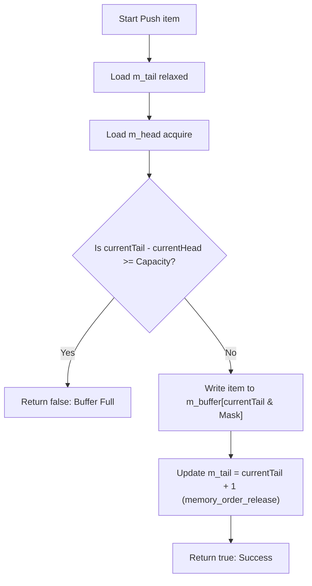
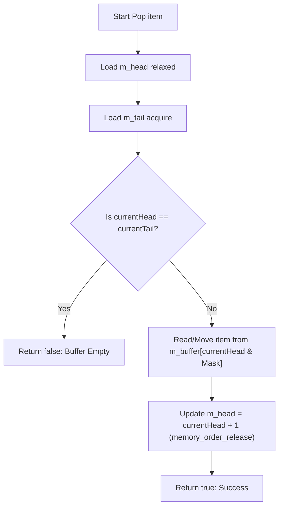
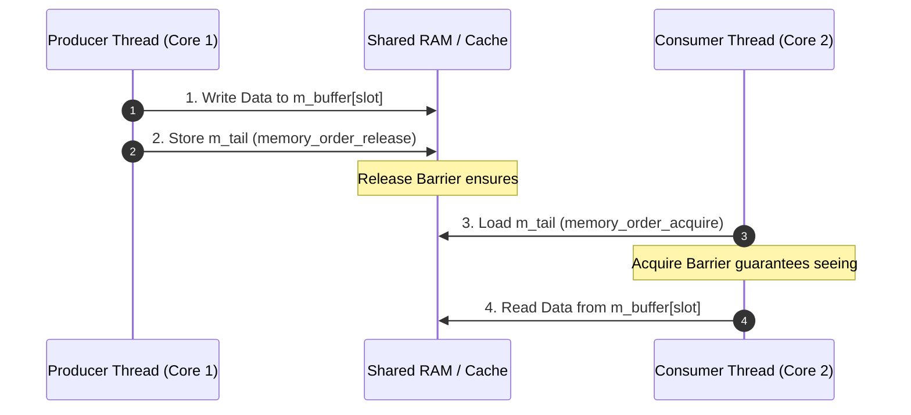

# Lock-Free Ring Buffer: Explained Like I'm 5 (ELI5)

This document provides a beginner-friendly, visual explanation of the **Single-Producer Single-Consumer (SPSC) Lock-Free Ring Buffer** implemented in [`lib/LockFreeRingBuffer.h`](../lib/LockFreeRingBuffer.h).

---

## 1. What is a Lock-Free Ring Buffer? 🍕

Imagine a **round lazy-susan pizza tray** with 8 numbered slice spots:

- **Chef (Producer)**: Puts fresh pizza slices onto the tray.
- **Customer (Consumer)**: Takes pizza slices off the tray and eats them.

```
                  [ Slot 0 ]
        [ Slot 7 ]          [ Slot 1 ]
   [ Slot 6 ]                    [ Slot 2 ]
        [ Slot 5 ]          [ Slot 3 ]
                  [ Slot 4 ]
```

### Why "Ring" (Circular)?
Instead of creating a new tray every time or sliding slices down a straight line, the tray is a circle. Once the Chef reaches **Slot 7**, the next slice goes back to **Slot 0** (if the Customer has already eaten the slice that was there!).

### Why "Lock-Free"?
In traditional code, whenever the Chef or Customer wants to touch the tray, they must grab a **padlock (Mutex)**. Only one person can hold the key at a time. If the Chef holds the key, the Customer has to wait (sleep).

With a **Lock-Free SPSC** buffer:
- The Chef **only updates the `m_tail` pointer** (where to put the next slice).
- The Customer **only updates the `m_head` pointer** (where to eat the next slice).
- They **never touch the same pointer**, so they never need to lock or wait on each other!

---

## 2. Dynamic ASCII Visualizations 🎨

### Scenario A: Empty Ring Buffer
When initialized, `m_head = 0` and `m_tail = 0`. Since `m_head == m_tail`, the tray is empty.

```
       m_head = 0 (Consumer reading here)
       m_tail = 0 (Producer writing here)
           │
           ▼
┌──────────┬──────────┬──────────┬──────────┬──────────┬──────────┬──────────┬──────────┐
│  Empty   │  Empty   │  Empty   │  Empty   │  Empty   │  Empty   │  Empty   │  Empty   │
└──────────┴──────────┴──────────┴──────────┴──────────┴──────────┴──────────┴──────────┘
  Slot 0     Slot 1     Slot 2     Slot 3     Slot 4     Slot 5     Slot 6     Slot 7
```

---

### Scenario B: Producer Pushes 3 Items
The Producer pushes `Item A`, `Item B`, and `Item C`.
- `m_tail` moves forward to index `3`.
- `m_head` stays at `0`.
- Items in buffer = `m_tail - m_head` = `3 - 0 = 3`.

```
       m_head = 0                            m_tail = 3
           │                                     │
           ▼                                     ▼
┌──────────┬──────────┬──────────┬──────────┬──────────┬──────────┬──────────┬──────────┐
│  Item A  │  Item B  │  Item C  │  Empty   │  Empty   │  Empty   │  Empty   │  Empty   │
└──────────┴──────────┴──────────┴──────────┴──────────┴──────────┴──────────┴──────────┘
  Slot 0     Slot 1     Slot 2     Slot 3     Slot 4     Slot 5     Slot 6     Slot 7
```

---

### Scenario C: Consumer Pops 2 Items
The Consumer eats `Item A` and `Item B`.
- `m_head` moves forward to index `2`.
- `m_tail` remains at `3`.
- Items remaining = `m_tail - m_head` = `3 - 2 = 1` (`Item C`).

```
                              m_head = 2     m_tail = 3
                                  │              │
                                  ▼              ▼
┌──────────┬──────────┬──────────┬──────────┬──────────┬──────────┬──────────┬──────────┐
│  Popped  │  Popped  │  Item C  │  Empty   │  Empty   │  Empty   │  Empty   │  Empty   │
└──────────┴──────────┴──────────┴──────────┴──────────┴──────────┴──────────┴──────────┘
  Slot 0     Slot 1     Slot 2     Slot 3     Slot 4     Slot 5     Slot 6     Slot 7
```

---

### Scenario D: Wrap-Around & Bitwise Masking (`Capacity = 8`)
Because `Capacity = 8` (a power of 2), finding the actual array index from a growing continuous counter (`m_tail` or `m_head`) uses a ultra-fast **bitwise AND** instead of expensive modulo division (`%`):

$$\text{Index} = \text{Counter} \ \& \ (\text{Capacity} - 1)$$

For `Capacity = 8`: $\text{Mask} = 7$ (`0b00000111`).

If `m_tail = 10`, the array index is $10 \ \& \ 7 = 2$ (`Slot 2`).

```
 Continuous Tail Counter = 10  ===>  10 & 7 = Slot 2 (Wrapped Around)

                        m_tail & Mask = Slot 2
                                  │
                                  ▼
┌──────────┬──────────┬──────────┬──────────┬──────────┬──────────┬──────────┬──────────┐
│  Item 8  │  Item 9  │ Item 10  │  Popped  │  Item 4  │  Item 5  │  Item 6  │  Item 7  │
└──────────┴──────────┴──────────┴──────────┴──────────┴──────────┴──────────┴──────────┘
  Slot 0     Slot 1     Slot 2     Slot 3     Slot 4     Slot 5     Slot 6     Slot 7
```

---

## 3. Operations Workflow (Mermaid Diagrams) 📊

### Push Operation (Producer Thread)



### Pop Operation (Consumer Thread)



---

## 4. Secret Sauce: CPU Hardware Performance Tricks 🚀

### Trick 1: Eliminating "False Sharing" (`alignas(64)`)
Modern CPU cores don't read bytes individually; they load 64-byte chunks called **Cache Lines**.

If `m_head` and `m_tail` were stored right next to each other in memory, CPU Core 1 (Producer) and CPU Core 2 (Consumer) would constantly invalidate each other's L1 Cache lines whenever updating their counters. This performance killer is called **False Sharing**.

```
WITHOUT ALIGNMENT (False Sharing):
┌────────────────────────────────────────────────────────┐
│ Cache Line (64 Bytes)                                  │
│ ┌──────────────────────────┬─────────────────────────┐ │  <-- Core 1 and Core 2 fighting!
│ │ m_head (8 Bytes)         │ m_tail (8 Bytes)        │ │      (Cache line keeps bouncing back & forth)
│ └──────────────────────────┴─────────────────────────┘ │
└────────────────────────────────────────────────────────┘

WITH alignas(64) (Isolated Cache Lines):
┌────────────────────────────────────────────────────────┐
│ Cache Line 1 (64 Bytes) -> Dedicated to CPU Core 1     │
│ ┌────────────────────────────────────────────────────┐ │  <-- Core 1 writes m_head safely
│ │ m_head (8 Bytes) + 56 Bytes Padding                │ │
│ └────────────────────────────────────────────────────┘ │
└────────────────────────────────────────────────────────┘
┌────────────────────────────────────────────────────────┐
│ Cache Line 2 (64 Bytes) -> Dedicated to CPU Core 2     │
│ ┌────────────────────────────────────────────────────┐ │  <-- Core 2 writes m_tail safely
│ │ m_tail (8 Bytes) + 56 Bytes Padding                │ │
│ └────────────────────────────────────────────────────┘ │
└────────────────────────────────────────────────────────┘
```

In [`lib/LockFreeRingBuffer.h`](../lib/LockFreeRingBuffer.h#L135-L137):
```cpp
alignas(CacheLineSize) std::atomic<std::size_t> m_head;
alignas(CacheLineSize) std::atomic<std::size_t> m_tail;
alignas(CacheLineSize) std::array<T, Capacity> m_buffer;
```

---

### Trick 2: Memory Orders (`Acquire` & `Release`)
Instead of using expensive hardware memory barriers (which pause the CPU), we use lightweight C++ memory ordering:

1. **`std::memory_order_release`** on `m_tail.store()`: Ensures the item data is completely written into `m_buffer` before the new `m_tail` index becomes visible to the Consumer.
2. **`std::memory_order_acquire`** on `m_head.load()`: Guarantees the Producer reads the latest `m_head` state without reordering.



---

## 5. Summary Checklist 📋

| Feature | Mutex-Based Queue (`std::mutex`) | Lock-Free SPSC Ring Buffer |
|---|---|---|
| **Synchronization** | OS Kernel Locks / Context Switches | Atomic CPU Instructions (`load`/`store`) |
| **Mean Latency** | ~1.13 µs | **~406 ns** (or sub-50 ns for pool) |
| **Max Producers/Consumers** | Multiple Readers / Writers | **Exactly 1 Producer + 1 Consumer** |
| **Memory Allocation** | Dynamic Heap (`malloc`) | Fixed Pre-allocated Array (`std::array`) |
| **False Sharing Safe?** | No guarantee | **Yes (`alignas(64)`)** |

---

## 6. Implementation Reference 🔗

- Header: [`lib/LockFreeRingBuffer.h`](../lib/LockFreeRingBuffer.h)
- Unit Tests: [`tests/unit_tests.cpp`](../tests/unit_tests.cpp)
- Benchmark: [`benchmark/lockfree_benchmark.cpp`](../benchmark/lockfree_benchmark.cpp)

---

## 7. External References & Further Reading 📚

1. **FastForward for Efficient Pipeline Parallelism: A Cache-Optimized Concurrent Lock-Free Queue** (John Giacomoni, Tipp Moseley, Manish Vachharajani — ACM PPoPP '08)
   - Direct Link: [ACM Digital Library (DOI: 10.1145/1345206.1345215)](https://doi.org/10.1145/1345206.1345215) | [ResearchGate Publication](https://www.researchgate.net/publication/221353987_FastForward_for_efficient_pipeline_parallelism_a_cache-optimized_concurrent_lock-free_queue)
   - *Explores cache line isolation, SPSC ring buffer layouts, and avoiding false sharing in multi-core processors.*
2. **Correct and Efficient Bounded FIFO Queues** (Dmitry Vyukov, 2010)
   - Direct Link: [1024cores Lock-Free Queue Catalog & Bounded Queues](https://sites.google.com/site/1024cores/home/lock-free-algorithms/queues/queue-catalog) | [Bounded MPMC Queue](https://sites.google.com/site/1024cores/home/lock-free-algorithms/queues/bounded-mpmc-queue)
   - *Technical breakdown of memory order barriers (`acquire`/`release`) and sequence indices in lock-free bounded ring buffers.*
3. **C++ Memory Order Specifications (`std::memory_order`)** — [cppreference.com](https://en.cppreference.com/w/cpp/atomic/memory_order)
   - *Official ISO C++ reference for atomic load/store memory synchronization constraints.*
4. **"atomic<> Weapons: The C++11 Memory Model and Hardware"** (Herb Sutter, CppCon / C++NW)
   - Direct Link: [Sutter's Mill Blog Overview](https://herbsutter.com/2013/02/11/atomic-weapons/) | Video: [Part 1 (YouTube)](https://www.youtube.com/watch?v=A8eCGOqgvH4) & [Part 2 (YouTube)](https://www.youtube.com/watch?v=KeLBd2EJLOU)
   - *Deep dive into sequential consistency, hardware reordering, acquire-release semantics, and CPU cache coherency (MESI protocol).*
5. **The LMAX Disruptor Architecture** (Martin Thompson, Dave Farley, Michael Barker, Patricia Gee, Andrew Stewart - 2011)
   - Direct Link: [LMAX Disruptor Technical Paper (PDF)](https://lmax-exchange.github.io/disruptor/files/Disruptor-1.0.pdf)
   - *Explains zero-lock ring buffer mechanics, cache-line padding, and high-throughput mechanical sympathy.*

