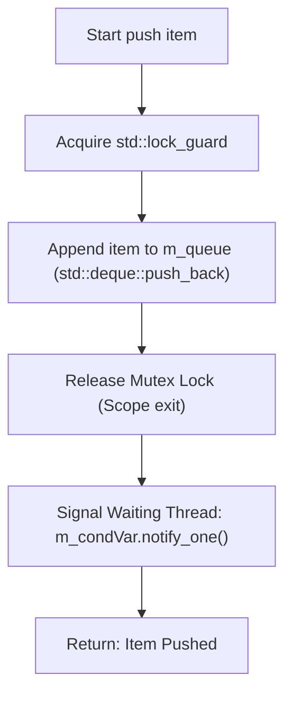
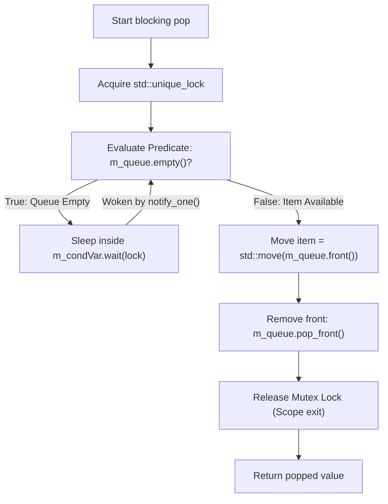
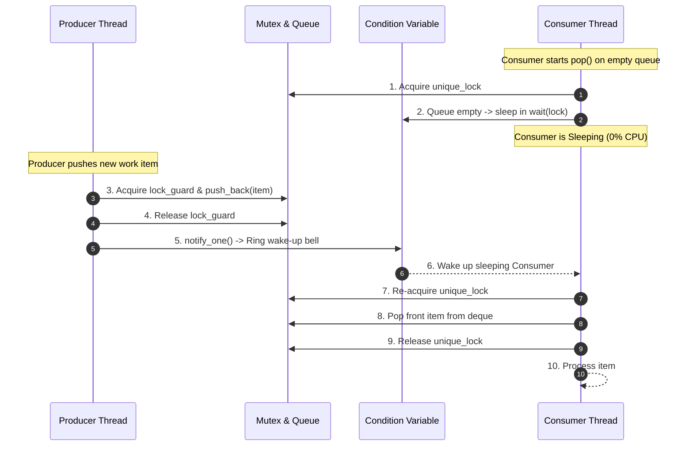

# Thread-Safe Queue: Explained Like I'm 5 (ELI5)

This document provides a beginner-friendly, visual explanation of the **Mutex-Protected Thread-Safe Queue** (`ThreadSafeQueue<T>`) implemented in [`lib/ThreadSafeQueue.h`](../lib/ThreadSafeQueue.h).

---

## 1. What is a Thread-Safe Queue? 🏦

Imagine a **Bank Deposit Box with a Security Door and a Service Bell**:

- **Customers (Producer Threads)**: Bring deposit slips (data items) and place them into the deposit box.
- **Bank Teller (Consumer Thread)**: Takes deposit slips out of the box and processes them.

```
       [ Producer 1 ]             [ Producer 2 ]
             │                          │
             ▼                          ▼
   ┌──────────────────────────────────────────────────┐
   │ Security Door (std::mutex)                       │
   │ ┌──────────────────────────────────────────────┐ │
   │ │ Deposit Box Array (std::deque<T>)            │ │
   │ └──────────────────────────────────────────────┘ │
   └──────────────────────────────────────────────────┘
                            │  🔔 Service Bell (std::condition_variable)
                            ▼
                   [ Consumer Teller (Sleeping when empty) ]
```

### Why Do We Need a Lock?
If two customers try to drop a slip into the box at the exact same millisecond without coordination, the slips could tear or overwrite each other! 

To prevent data corruption:
1. **Security Door (`std::mutex`)**: Only one person can open the box at a time.
2. **Service Bell (`std::condition_variable`)**: If the box is empty, the Teller goes to sleep in their chair (using **0% CPU**). When a customer drops a slip into the box, they ring the bell (`notify_one()`), instantly waking up the Teller!

---

## 2. Dynamic ASCII Visualizations 🎨

### Scenario A: Producer Pushes Item & Rings Bell (`push(item)`)
Producer Thread 1 locks the mutex, appends `Item A` to `std::deque`, releases the lock, and notifies the condition variable.

```
Step 1: Lock Mutex      Step 2: Append Item A     Step 3: Unlock & Ring Bell
┌──────────────┐        ┌─────────────────────┐   ┌───────────────────────────┐
│ Mutex LOCKED │ ────>  │ deque: [ Item A ]   │ ─>│ Mutex UNLOCKED            │
└──────────────┘        └─────────────────────┘   │ notify_one() ──🔔 Wakes T1 │
                                                  └───────────────────────────┘
```

---

### Scenario B: Blocking Pop on Empty Queue (`pop()`)
Consumer Thread 1 tries to pop, sees the queue is empty, and enters a sleeping state inside `wait()` until notified.

```
Consumer T1: Lock Mutex ──> Check deque (Empty!) ──> Unlock Mutex & SLEEP (0% CPU)
                                                          │
                                                          ▼ (Sleeping inside wait())
Producer T2: Lock Mutex ──> Push Item B ──> Unlock ──> Ring Bell (notify_one())
                                                          │
                                                          ▼
Consumer T1: WAKES UP! ──> Re-acquire Mutex ──> Pop Item B ──> Unlock Mutex
```

---

### Scenario C: Non-Blocking & Timed Pops (`tryPop()` vs `popFor()`)

```
1. tryPop():
   Lock Mutex ──> Is queue empty? ──[YES]──> Return std::nullopt (Instant!)
                                  ──[NO] ──> Pop item & Return std::optional<T>

2. popFor(50ms):
   Lock Mutex ──> Wait up to 50ms for notification:
                  ├── Item arrives in 10ms ──> Pop item & Return std::optional<T>
                  └── Timeout after 50ms  ──> Return std::nullopt
```

---

## 3. Operations Workflow (Mermaid Diagrams) 📊

### Producer Push Flow (`push(item)`)



### Consumer Blocking Pop Flow (`pop()`)



---

### End-to-End Producer-Consumer Synchronization



---

## 4. Key Performance Characteristics & Trade-offs ⚖️

### 1. Zero CPU Waste When Idle
Unlike lock-free queues that busy-spin or poll in a `while` loop, `ThreadSafeQueue::pop()` uses `std::condition_variable::wait()`. When no items are in the queue, consumer threads sleep in the OS kernel, consuming **0% CPU**.

### 2. Multi-Producer Multi-Consumer (MPMC) Support
Supported by design. Any number of producer threads and consumer threads can safely call `push()`, `pop()`, `tryPop()`, and `popFor()` concurrently.

### 3. Latency vs Lock-Free Structures
- **`ThreadSafeQueue`**: ~1.13 µs mean latency (kernel context switches and mutex contention).
- **`LockFreeRingBuffer` / `LockFreeMemoryPool`**: Sub-400 ns latency (no kernel locks).

---

## 5. Summary Feature Checklist 📋

| Feature | Standard `std::deque` (Not Safe) | `ThreadSafeQueue<T>` | Lock-Free SPSC Ring Buffer |
|---|---|---|---|
| **Thread Safety** | None (Data race / crash) | **Full MPMC Thread Safety** | Single-Producer / Single-Consumer |
| **Idle Behavior** | N/A | **Sleeps in OS Kernel (0% CPU)** | Busy-spin or yield loop |
| **Capacity** | Dynamic growth | **Dynamic growth (`std::deque`)** | Fixed pre-allocated array |
| **Synchronization** | None | **`std::mutex` + `std::condition_variable`** | Atomic `acquire`/`release` |
| **Mean Latency** | N/A | **~1.13 µs** | **~406 ns (Sub-50 ns pool)** |

---

## 6. Implementation Reference 🔗

- Header: [`lib/ThreadSafeQueue.h`](../lib/ThreadSafeQueue.h)
- Unit Tests: [`tests/unit_tests.cpp`](../tests/unit_tests.cpp)
- Benchmark: [`benchmark/lockfree_benchmark.cpp`](../benchmark/lockfree_benchmark.cpp)

---

## 7. External References & Further Reading 📚

1. **C++ Concurrency in Action: Practical Multithreading** (Anthony Williams)  
   - Direct Link: [Manning Publications Page](https://www.manning.com/books/c-plus-plus-concurrency-in-action-second-edition)
   - *Chapter 3 & 4: Sharing data between threads, Condition variables, and Designing concurrent data structures.*
2. **C++ Standard Concurrency Primitives** — cppreference.com  
   - Direct Link: [`std::mutex`](https://en.cppreference.com/w/cpp/thread/mutex) | [`std::condition_variable`](https://en.cppreference.com/w/cpp/thread/condition_variable) | [`std::unique_lock`](https://en.cppreference.com/w/cpp/thread/unique_lock)
   - *Official ISO C++ specifications for thread synchronization primitives.*
3. **POSIX Condition Variables (`pthread_cond_wait`)** — IEEE Std 1003.1  
   - Direct Link: [POSIX `pthread_cond_wait` Specification](https://pubs.opengroup.org/onlinepubs/9699919799/functions/pthread_cond_wait.html)
   - *Underlying OS kernel implementation of condition variable sleeping and notification.*
